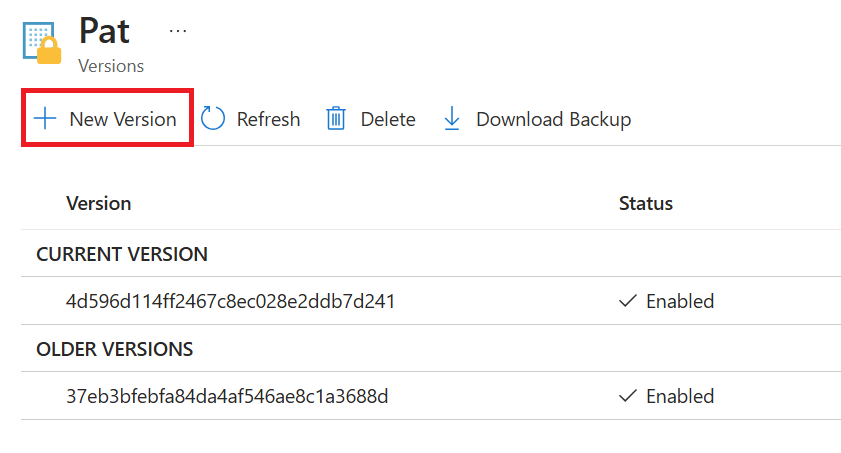
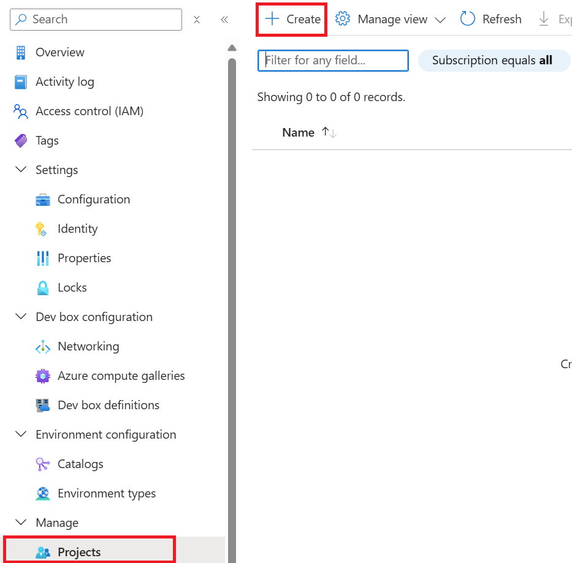
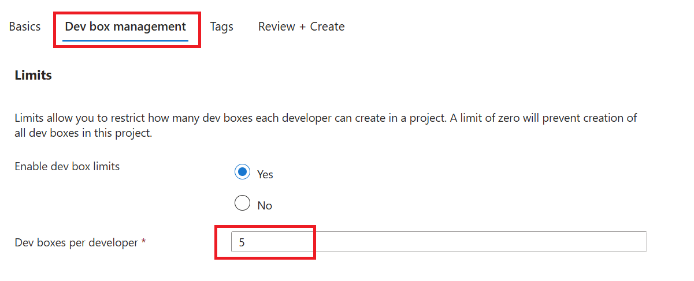
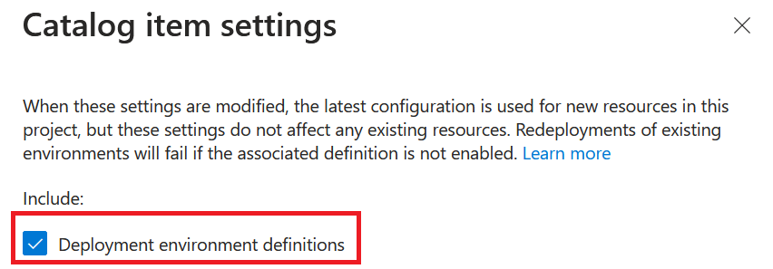
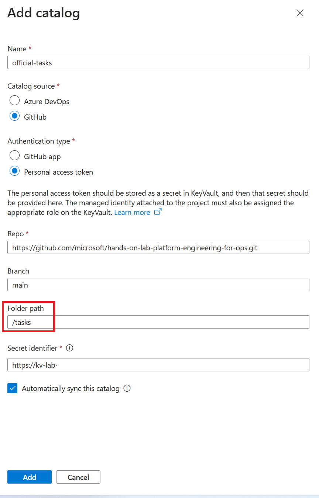
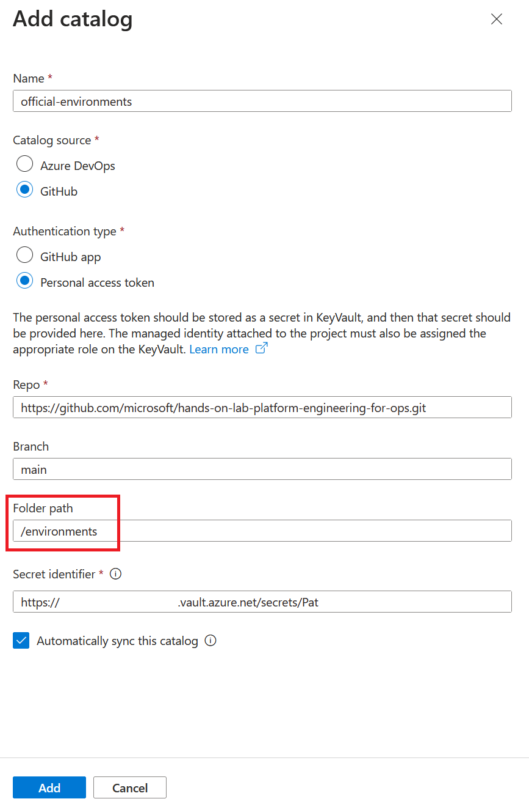
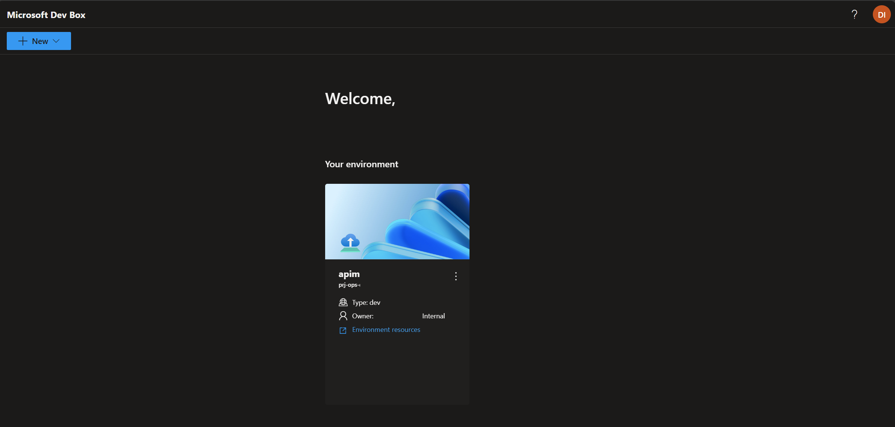

# Product Hands-on Lab - Platform engineering for Ops

Welcome to this Platform engineering for Ops Workshop. You'll be experimenting with Azure services in multiple labs to undestand real world scenarios. Don't worry, this is a step by step lab, you will be guided through the whole process.

During this workshop you will have the instructions to complete each steps. It is recommended to search for the answers in provided resources and links before looking at the solutions placed under the '📚 Toggle solution' panel.

<div class="task" data-title="Task">

> You will find the instructions and expected configurations for each Lab step in these yellow **TASK** boxes.
> Inputs and parameters to select will be defined, all the rest can remain as default as it has no impact on the scenario.

</div>

## Pre-requisites

Before starting this lab, be sure to set your Azure environment :

- An Azure Subscription with the **Owner** role to create and manage the labs' resources and deploy the infrastructure as code
- Register the Azure providers on your Azure Subscription if not done yet: `Microsoft.DevCenter`, `Microsoft.KeyVault`, `Microsoft.ApiManagement`, `Microsoft.Web`.

To be able to do the lab content :

- A Github account (Free, Team or Enterprise)
- Create a [fork][repo-fork] of the repository from the **main** branch to help you keep track of your changes


3 development options are available:
  - 🥇 **Preferred method** : Pre-configured GitHub Codespace 
  - 🥈 Local Devcontainer
  - 🥉 Local Dev Environment with all the prerequisites detailed below

<div class="tip" data-title="Tips">

> To focus on the main purpose of the lab, we encourage the usage of devcontainers/codespace as they abstract the dev environment configuration, and avoid potential local dependencies conflict.
> 
> You could decide to run everything without relying on a devcontainer : To do so, make sure you install all the prerequisites detailed below.

</div>

### 🥇 : Pre-configured GitHub Codespace

To use a Github Codespace, you will need :
- [A GitHub Account][github-account]

Github Codespace offers the ability to run a complete dev environment (Visual Studio Code, Extensions, Tools, Secure port forwarding etc.) on a dedicated virtual machine. 
The configuration for the environment is defined in the `.devcontainer` folder, making sure everyone gets to develop and practice on identical environments : No more conflict on dependencies or missing tools ! 

Every Github account (even the free ones) grants access to 120 vcpu hours per month, _**for free**_. A 2 vcpu dedicated environment is enough for the purpose of the lab, meaning you could run such environment for 60 hours a month at no cost!

To get your codespace ready for the labs, here are a few steps to execute : 
- After you forked the repo, click on `<> Code`, `Codespaces` tab and then click on the `+` button:


- You can also provision a beefier configuration by defining creation options and select the **Machine Type** you like: 


### 🥈 : Using a local Devcontainer

This repo comes with a Devcontainer configuration that will let you open a fully configured dev environment from your local Visual Studio Code, while still being completely isolated from the rest of your local machine configuration : No more dependency conflict.
Here are the required tools to do so : 

- [Git client][git-client] 
- [Docker Desktop][docker-desktop] running
- [Visual Studio Code][vs-code] installed

Start by cloning the Hands-on Lab Platform engineering for Ops repo you just forked on your local Machine and open the local folder in Visual Studio Code.
Once you have cloned the repository locally, make sure Docker Desktop is up and running and open the cloned repository in Visual Studio Code.  

You will be prompted to open the project in a Dev Container. Click on `Reopen in Container`. 

If you are not prompted by Visual Studio Code, you can open the command palette (`Ctrl + Shift + P`) and search for `Reopen in Container` and select it: 


### 🥉 : Using your own local environment

The following tools and access will be necessary to run the lab in good conditions on a local environment :  

- [Git client][git-client] 
- [Visual Studio Code][vs-code] installed (you will use Dev Containers)
- [Azure CLI][az-cli-install] installed on your machine
- [Terraform][terraform-install] installed, this will be used for deploying the resources on Azure

Once you have set up your local environment, you can clone the Hands-on Lab Platform engineering for Ops repo you just forked on your machine, and open the local folder in Visual Studio Code and head to the next step. 

### 🔑 Sign in to Azure

<div class="task" data-title="Task">

> - Log into your Azure subscription in your environment using Azure CLI and on the [Azure Portal][az-portal] using your credentials.
> - Instructions and solutions will be given for the Azure CLI, but you can also use the Azure Portal if you prefer.

</div>

<details>

<summary>📚 Toggle solution</summary>

```bash
# Login to Azure : 
# --tenant : Optional | In case your Azure account has access to multiple tenants

# Option 1 : Local Environment or Dev Container
az login --tenant <yourtenantid or domain.com>
# Option 2 : Github Codespace : you might need to specify --use-device-code parameter to ease the az cli authentication process
az login --use-device-code --tenant <yourtenantid or domain.com>

# Display your account details
az account show
# Select your Azure subscription
az account set --subscription <subscription-id>

# Register the following Azure providers if they are not already

# Microsoft DevCenter
az provider register --namespace 'Microsoft.DevCenter'
# Azure Key Vault
az provider register --namespace 'Microsoft.KeyVault'
# Azure API Management
az provider register --namespace 'Microsoft.ApiManagement'
# Azure Functions & Azure Web Apps
az provider register --namespace 'Microsoft.Web'
```

</details>

## Deploy the infrastructure

You must deploy the infrastructure before starting the lab. 

First, you need to initialize the terraform infrastructure by running the following command:

```bash
cd terraform && terraform init
```

If you wan't to create multiple users for the lab, you can create a `env.tfvars` file and change set the `number_of_users` variable to the number of users you want to create.

```js
domain_name           = "example.onmicrosoft.com"
user_default_password = "SET_YOUR_PASSWORD_HERE"
number_of_users       = 20
```

Then run the following command to deploy the infrastructure:

```bash
# Use the -var-file flag to specify the env.tfvars file only if you created it
terraform plan -out plan.out -var-file env.tfvars
# Deploy the infrastructure
terraform apply plan.out
```

The deployment should take around 2 minutes to complete.

## Create a GitHub PAT

To be able to use the Catalogs features in Azure Dev Center, you need to create a GitHub Personal Access Token (PAT) with the following permissions:

In GitHub, select the profile image, and then select Settings. On the left sidebar, select **Developer settings** > **Personal access tokens** > **Fine-grained tokens**, Select **Generate new token**.

On the New fine-grained personal access token page, provide the following information:

Set a descriptive name for the token, an expiration date to 30 days, and select the following permissions:

In `Repository access` select **All repositories**, then expand `Repository permissions`, and for `Contents`, from the Access list, select `Read Only`.

Then click on **Generate token**. If you need more information on this mechanism you can refer to the [official documentation][az-dev-center-github-pat].

Now, open the resource group deploy with Terraform previously and open the Key Vault. In the **Secrets** tab, you will find a secret named Pat, click on it and then select **New Version** and update the value with your GitHub Token:



## Activate the Catalog feature

Finally, in the Dev Center, go to **Settings** and then **Configuration** and Click on **Enable Catalog per projects**. This will allow you to define your catalogs at the project level, you will learn more about this in the lab.


Validate the change and you are ready for the lab.

[az-cli-install]: https://learn.microsoft.com/en-us/cli/azure/install-azure-cli
[az-dev-center-github-pat]: https://learn.microsoft.com/en-us/azure/deployment-environments/how-to-configure-catalog?tabs=GitHubRepoPAT#add-a-catalog
[az-portal]: https://portal.azure.com
[docker-desktop]: https://www.docker.com/products/docker-desktop/
[git-client]: https://git-scm.com/downloads
[github-account]: https://github.com/join
[repo-fork]: https://github.com/microsoft/hands-on-lab-platform-engineering-for-ops/fork
[vs-code]: https://code.visualstudio.com/
[terraform-install]: https://learn.hashicorp.com/tutorials/terraform/install-cli

---

# Lab 1 - Dev Box Management

Dev Center is a platform that allows you to create and manage Dev Boxes for your developers. Dev Boxes are fully managed development environments that can be customized to meet the needs of your developers. You can create Dev Box definitions that define the size and configuration of the Dev Boxes, and then create Dev Box pools that contain the Dev Box definitions. Developers can then create Dev Boxes from the Dev Box pools on demands.

Dev Boxes are VM instances that are created in your Azure subscription and managed behind the scene using Intune. They are fully managed by Microsoft and are automatically updated with the latest security patches and updates. Dev Boxes is designed for developers.  

The goal of this lab is to create a project in the Dev Center and assign Dev Box definitions to it. You will also create Dev Box pools for a project and assign the Dev Box definitions to them. The developers assigned to the project will then be able to create Dev Boxes on demands. You will also see how to enable customizations for the Dev Boxes using catalogs.

## Create a Dev Box definition

To reflect a real-world scenario, we will create two Dev Box definitions, one for the frontend and one for the backend. The Dev Box definitions will have different sizes and configurations to meet the needs of the developers working on the frontend and the backend.

<div class="task" data-title="Tasks">

> Create 2 Dev Box definitions, one for the frontend and one for the backend.
>
> The frontend Dev Box definition should have the following configuration:
> - Name: `dev-box-ops-win-11-frontend-<your-initials>`
> - Image: Pick a Visual Studio 2022 image with Windows 11
> - Image version: `Latest`
> - Compute size: `8 vCPUs, 32 GB RAM`
>
> The backend Dev Box definition should have the following configuration:
> - Name: `dev-box-ops-win-11-backend-<your-initials>`
> - Image: Pick a Visual Studio 2022 image with Windows 11
> - Image version: `Latest`
> - Compute size: `16 vCPUs, 64 GB RAM`
>

</div>

<div class="tip" data-title="Tips">

> [Dev Box Definition setup][dev-box-definition]<br>

</div>

<details>
<summary>📚 Toggle solution</summary>

To do that, inside the Dev Center, go to **Dev Box Definitions** and select **Create**

Create a new Dev Box definition with the following parameters to represent the frontend Dev Box:

- Name: `dev-box-ops-win-11-frontend-<your-initials>`
- Image: Pick a Visual Studio 2022 image with Windows 11
- Image version: `Latest`
- Compute size: `8 vCPUs, 32 GB RAM`
- Disk size: `256 GiB SSD`

And enable the Hibernate mode. The Hibernation feature is a power-saving state that saves your running applications to your hard disk and then shuts down the virtual machine (VM). When you resume the VM, all your previous work is restored.


Repeat the same steps to create a new Dev Box definition for the backend:

- Name: `dev-box-ops-win-11-backend-<your-initials>`
- Image: Pick a Visual Studio 2022 image with Windows 11
- Image version: `Latest`
- Compute size: `16 vCPUs, 64 GB RAM`
- Disk size: `512 GiB SSD`

You have now created two Dev Box definitions, one for the frontend and one for the backend.


These Dev Boxes definitions are now available at the Dev Center level, the next step is to assign them to a project.

</details>

## Create a project

A project in Dev Center represent a group of developers working on a specific project. You can assign Dev Box definitions to a project and then create Dev Box pools for the project. Developers assigned to the project will be able to create Dev Boxes from the Dev Box pools.

<div class="task" data-title="Tasks">

> Create a project in the Dev Center with the following configuration:
> - Name: `prj-ops-<your-initials>`
> - Set the number of Dev Boxes to 5 as a maximum for each developer

</div>

<details>
<summary>📚 Toggle solution</summary>

Inside your Dev Center, go to **Manage** > **Projects** and click on **Create**.



Give a name that start with `prj-ops-<your-initials>` and then add your initials.


In the **Dev Box Management** panel you can directly fix the number of Dev Boxes for this project.

Select **Yes** and set the maximum number of Dev Boxes that can be deployed per each developer to `5`:



Click on **Review + Create** and then **Create**.

After a few seconds, the project is created. Open it.

</details>

## Create Dev Box pools for the project

The next step is to give access to the Dev Box definitions in the project. To do this, you need to create Dev Box pools for the project and assign the Dev Box definitions to them.

<div class="task" data-title="Tasks">

> Create 2 Dev Box pools for the project, one for the frontend and one for the backend.
>
> The frontend Dev Box pool should have the following configuration:
> - Name: `dev-box-ops-win-11-frontend`
> - Dev Box definition: `dev-box-ops-win-11-frontend-<your-initials>`
> - Network: `Microsoft Hosted network` in `West Europe`
> - Select `Local Administrator`
> - Auto-stop mode: `Enabled` with your preferred time
>
> The backend Dev Box pool should have the same configuration except the name:
> - Name: `dev-box-ops-win-11-backend`

</div>

<details>
<summary>📚 Toggle solution</summary>

Inside your project, go to **Dev Box Pools** and click on **Create**.

Start with the frontend one, give it the name `dev-box-ops-win-11-frontend`  and select the Dev Box definition you created for the frontend.

For the network part, you can inject a Dev Box into a specific VNet but for this lab, we will keep it simple and use the default Microsoft Hosted network in `West Europe`.

Select `Local Administrator` so the user can have full control over the Dev Box:


To save on costs, you can enable an auto-stop schedule on a dev box pool. Microsoft Dev Box attempts to stop all dev boxes in the pool at the time specified in the schedule. You can configure one stop time in one timezone for each pool.


Check the licence agreement and click on **Create**.

Repeat the same steps to create a Dev Box pool for the backend Dev Box definition.

You have now created two Dev Box pools, one for the frontend and one for the backend. The developers assigned to this project will be able to create Dev Boxes from these pools only.

</details>

## Assign an identity to the project

Go to the **Settings** tab and click on **Identity** and add a System Assigned Managed Identity:


Wait for the identity to be created.

This will be used for the project to be able to interact with other Azure services such as the Key Vault that you will need later.

Go to the resource group and open the Key Vault. In the **Access policies** tab, add a new access policy for the project identity (`prj-ops-<your-initials>`) with the following permissions:

- **Secret permissions**: `Get` and `List`

Click on **Create**, you have now given the project identity the permissions to get and list secrets from the Key Vault.

## Autorized customizations

At this point, you have created a project with Dev Box pools for the frontend and the backend developers. Those Dev Box pools provide default configuration for your developers. However, you may want to allow your developers to customize their Dev Boxes to meet their specific needs or to install additional tools. This is possible by authorizing customizations at the project level.

Developers can customize their Dev Boxes using yaml files such as this one at the instanciation of the Dev Box:

```yaml
# https://github.com/microsoft/devcenter-catalog
# From https://github.com/microsoft/devcenter-examples
# Optionaly declare the devbox image to use 

$schema: 1.0
name: "devbox-customization-example"
tasks:
  - name: choco
    parameters:
      package: vscode

  - name: choco
    parameters:
      package: azd

  - name: git-clone
    description: Clone this repository into C:\Documents
    parameters:
      repositoryUrl: https://github.com/microsoft/dotnet.git
      directory: C:\Documents

# Other possibilities: powershell, winget, install-vs-extension   
```

As you can see it's composed only of tasks that will be executed at the creation of the Dev Box. Those tasks are not available by default, you need to enable them at the project level.

You can control the different tasks that can be executed on the Dev Box by adding or not their definitions in a catalog.

Official catalogs are available here:

https://github.com/microsoft/devcenter-catalog in the `Tasks` folder
https://github.com/microsoft/devcenter-examples in the `advanced-examples` folder

You can pick the tasks you want and put it in your own company repository and then refer it to the project as a catalog or refer these repositories directly.

In our case we have a folder called `tasks` available in this [Git repository][git-repo] with the following tasks:

- choco
- customization-wsl
- download-ado-artifacts
- git-clone
- install-by-curl
- install-vs-extension
- powershell
- winget

To enable the use of catalog items, go to your project, under **Settings**, select **Catalogs**. 


In the **Catalog item settings** pane, select **Azure deployment environment definitions** to enable the use of environment definitions at the project level.



Now, you can add a catalog to the project.

<div class="task" data-title="Tasks">

> - Add the Catalog `/tasks` available in the [Git repository][git-repo] of this lab to the project to enable the use of catalog items at the project definition. <br>
> - Target the `main` branch of the repository.<br>
> - Use the GitHub PAT token secret available in the Key Vault by refering this url with the right name: `https://<YOUR-KEY-VAULT-NAME>.vault.azure.net/secrets/Pat`
> - Give the catalog the name `official-tasks`

</div>

<div class="tip" data-title="Tips">

> [Add a catalog with a GitHub PAT][add-catalog-with-github-pat]<br>

</div>

<details>
<summary>📚 Toggle solution</summary>

Let's add the catalog to the project. Go to the project **Settings** and then **Catalogs** and click on **Add**.



Set the `Repo` url to `https://github.com/microsoft/hands-on-lab-platform-engineering-for-ops.git` and target the `main` branch. 

Notice the `/` before the folder name `tasks`, this is important to specify the folder where the tasks are located.

Then go to the resource group to retreive the Key Vault name. This will be used to retreive the secrets from the Key Vault. The Pat is located at this location:

```bash
https://<YOUR-KEY-VAULT-NAME>.vault.azure.net/secrets/Pat
```

Click on **Add** and you should see the catalog added to the project with a status of `Sync Successful`.

Now, the developers assigned to this project will be able to use the tasks defined in the catalog to customize their Dev Boxes.

</details>

## Act as a Developer

To see the Dev Box in action, you can act as a developer assigned to the project.

In your project go to **Access control (IAM)** and add the role `DevCenter DevBox User` to your self at the project level.

Go to the [Dev Box Portal][dev-box-portal] and sign in, you should see a button to create a new Dev Box and be able to pass a yaml file to customize your Dev Box similar to the one we saw previously.

You can see the total number of Dev Boxes created per definitions in the **Manage** > **Dev box pools** section.

[add-catalog-with-github-pat]: https://learn.microsoft.com/en-us/azure/deployment-environments/how-to-configure-catalog?tabs=GitHubRepoPAT#add-your-repository-as-a-catalog
[dev-box-definition]: https://learn.microsoft.com/en-us/azure/dev-box/how-to-manage-dev-box-definitions
[git-repo]: https://github.com/microsoft/hands-on-lab-platform-engineering-for-ops

---

# Lab 2 - Manage deployment environments

Dev Center allows you to create and manage deployment environments for your projects which is the Azure Deployment Environment service. 

Deployment environments are fully managed environments that can be customized to meet the needs of your developers based on Infra As Code (ARM, Bicep, Terraform, Pulumi). Developers can then deploy pre packaged environments in a safe and controlled way using the best practice of your company.

## Add an environment to the project

If you go to your Dev Center, in the **Environment Configuration** and then **Environment Type** section, you will see that 3 environments are already available: `dev`, `test`, and `prod`. Each environment can be linked to a specific subscription but for this lab, you will use the same subscription for all the environments.

Those environments are the only ones available for all the projects linked to the Dev Center. Each project can refer to one or more of these environments. You can give different permissions to the developers to each environment for each project.

In fact, you can imagine scenarios where developers will have more rights in the `dev` environment than in the `prod` environment.

<div class="task" data-title="Tasks">

> Link the 3 environments available in the Dev Center to your project.
> Set the following permissions to your developers for each environment:
> - In `dev` environment the `Owner` role
> - In `test` environment the `Contributor` role
> - In `prod` environment the `Reader` role

</div>

<details>
<summary>📚 Toggle solution</summary>

In your project, go to **Environment Configuration** and then **Environment Type**. In this section you will link the environments available in the Dev Center to the project. 

Click on **Add**, you will be redirected to a form where you can select the environment you want to link to the project.

So for each environment, select the role you want to give to your developers and click on **Add**.


If everything is ok, you should see the 3 environments linked to the project in the **Environment Type** section:


</details>

## Add environment catalog

As you saw in the previous lab, you can add a catalog to a project to allow developers to customize their Dev Boxes.

However, catalogs can also be used to define the Azure environments that will be available in the project. These catalogs of Azure resources are created by the ops team to give the developers team the appropriate area to deploy their application in compliance with company rules.

The developers will be able to create environments using the same [portal][dev-box-portal] as they used for Dev Boxes.

To define an environment for a catalog you need to create a yaml file that will define the environment configuration and assiate this file with an Infra As Code template.

The templates that you will use for this lab are located in the `environments` folder of this [repository][git-repo].

As you can see, you have 2 folders:
- `WebApp` to create a Web App environment (made using ARM)
- `ContainerApp` to create your Container App (made using Bicep)

Inside each folder you have:
- an `environment.yaml` file that defines the environment configuration
- an `azuredeploy.json` file that defines the ARM template to deploy the environment or a `main.bicep` file if you prefer to use Bicep

You can also use Terraform and Pulumi to define your environments. Of course, you can create as much as infra as code files as you want to define your environment, you will just need to follow official conventions to have the right name for the entry point file.

More examples are available in this [official catalog templates][ade-official-catalog]

<div class="task" data-title="Tasks">

> Add the `environments` folder from this [repository][git-repo] as a catalog to your project.
> Use the `main` branch of the repository.
> Use the GitHub PAT token secret available in the Key Vault by refering this url with the right name: 
> `https://<YOUR-KEY-VAULT-NAME>.vault.azure.net/secrets/Pat`
> Give the catalog the name `official-environments`

</div>

<details>
<summary>📚 Toggle solution</summary>

To add the catalog to the project, go to the project **Settings** and then **Catalogs** and click on **Add**.


Set the `Repo` url to `https://github.com/microsoft/hands-on-lab-platform-engineering-for-ops.git` and target the `main` branch. 

Notice the `/` before the folder name `environments`, this is important to specify the folder where the different Infra As Code templates are located.

Then go to the resource group to retreive the Key Vault name. Like previously, this will be used to retreive the secrets from the Key Vault. The Pat is located at this location:

```bash
https://<YOUR-KEY-VAULT-NAME>.vault.azure.net/secrets/Pat
```

Click on **Add** and you should see the catalog added to the project with a status of `Sync Successful`.



You now have a catalog of environments available in your project. Developers assigned to this project will be able to create environments using the templates defined in this catalog.
</details>

## Create a catalog 

Let's imagine that you want to create your own catalog of environments. This is a basic use case, if you have a specific environment configuration which reflect exactly one of your project.

Let's do this by providing an APIM environment using Bicep.

<div class="task" data-title="Tasks">

> Create your own catalog. In your own GitHub account, create a new **Public** repository and in an `CustomEnvironments` folder create an `Apim` folder
> Add an `environment.yaml` file to define only the name of the APIM as a parameter
> Add a `main.bicep` file to define the APIM deployment using Bicep and the Consumption SKU
> Add the catalog to the project in the same way you did for the previous catalogs.

</div>

<details>
<summary>📚 Toggle solution</summary>

In your own GitHub account, create a new repository **Public** and in a `CustomEnvironments` folder create an `Apim` folder the following files:


The `environment.yaml` contains the following:

```yaml
name: APIM
summary: This is an APIM deployment using Bicep.
description: Deploys an APIM using the Consumption Sku.
templatePath: main.bicep
parameters:
- id: name
  name: Name
  description: 'Name of the Apim'
  type: string
  required: true
runner: Bicep
```

And the `main.bicep` file contains the following:

```bicep
@description('The name of the API Management service instance')
param name string = ''

var resourceName = !empty(name) ? replace(name, ' ', '-') : 'apim'

@description('Location for all resources.')
param location string = resourceGroup().location

resource apiManagementService 'Microsoft.ApiManagement/service@2023-05-01-preview' = {
  name:  'resourceName${uniqueString(resourceGroup().id)}'
  location: location
  sku: {
    name: 'Consumption'
    capacity: 0
  }
  properties: {
    publisherEmail: 'company@company.me'
    publisherName: 'Company'
  }
}
```

Of course the deployment can be more complex, with multiple bicep files and modules but let's keep it simple for this lab.

Now, you can add this catalog to the project in the same way you did for the previous catalog.

If you need to update the catalog, you can do it by updating the files in the repository and then click on **Sync** in the catalog settings of the project.

</details>

## Act as a Developer

Let's act as a developer to try to create an environment using the catalog you just added. 

Add the role `Deployment Environments User` to your self  at the project level.

Go to the [Dev Box Portal][dev-box-portal] and sign in.

You should see a button to create a new environment:



You can select the environment you want to create and pass the parameters needed for the deployment. After the deployment is done you can see the resources deployed by just clicking in the **Environment resources** link.

The developers can use the Dev Box portal to deploy their environment but if they prefer they can use [Azure Developer CLI][azd-link] (azd) which is just one config file to add to their project to be able to deploy the environment using the CLI.

## Act as a project administrator

Let's act as an ops to see the deployment environments created by the developers.

Add the role `DevCenter Project Admin` to your self at the project level.

In the Azure Portal, in your project go to **Manage** and then **Environments**. You should see the environments created by the developers:

// ADD IMAGE

You can see the associated cost for each deployment using the `View Cost` tab and potential advisor recommendations. As an Ops this will help you to control the cost of the deployments and to update your Infra As Code templates based on the security recommendations.

[ade-official-catalog]: https://github.com/Azure/deployment-environments
[dev-box-portal]: https://devbox.microsoft.com/
[git-repo]: https://github.com/microsoft/hands-on-lab-platform-engineering-for-ops
[azd-link]: https://learn.microsoft.com/en-us/azure/developer/azure-developer-cli/

---

# Lab 3 


---

# Closing the workshop

Once you're done with this lab you can delete the resource group you created at the beginning.

To do so, click on `delete resource group` in the Azure Portal to delete all the resources and audio content at once. The following Az-Cli command can also be used to delete the resource group :

```bash
# Delete the resource group with all the resources
az group delete --name <resource-group>
```

Also, for security purpose, remove the unused GitHub PAT token in your GitHub account.